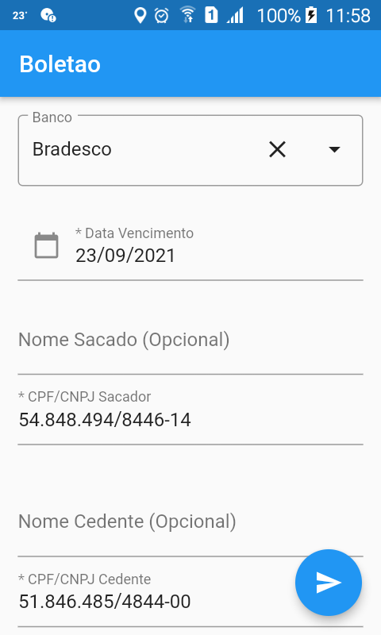
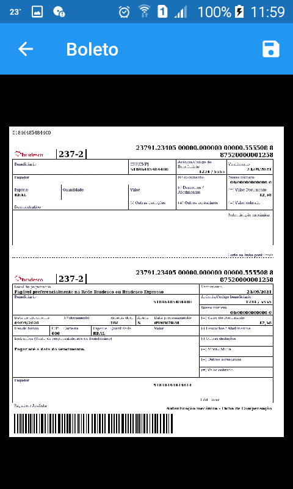
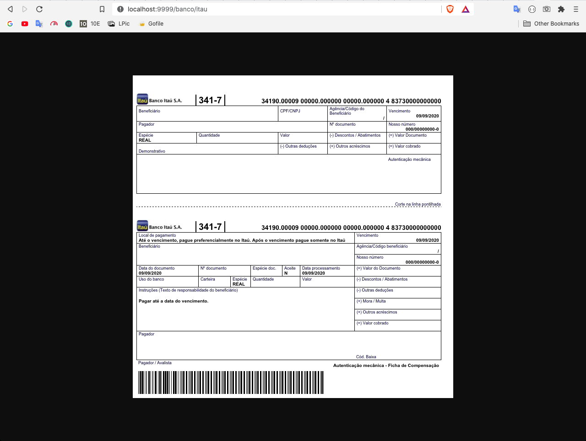
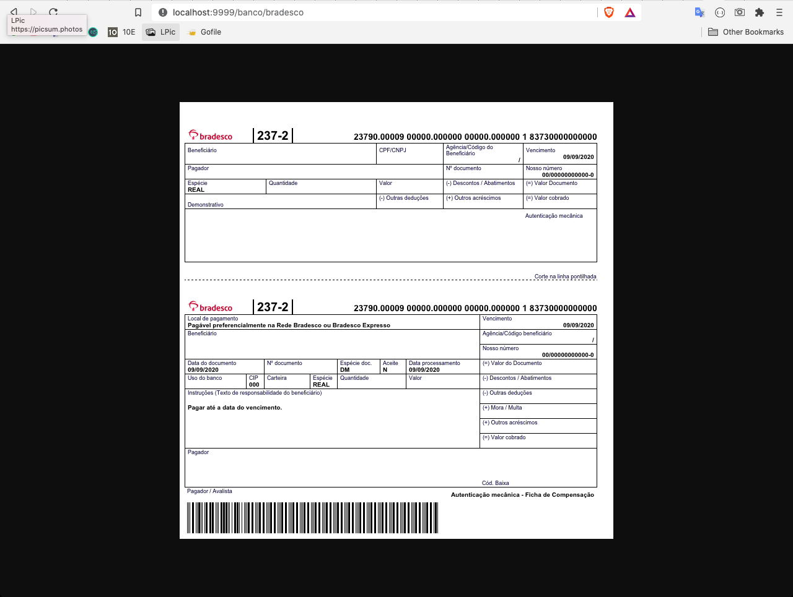

# Boletao

Cliente e Servidor gerador de boletos para varios bancos.

# Demo
Demo criada com o Flutter, exportando para web.
> **https://stdioh321.github.io/boletao-php**


# Cliente
Cliente foi criado usando o **FLUTTER**

## Requisitos
1.  [Flutter](https://flutter.dev/docs/get-started/install)

## Setup
```
$ git clone https://github.com/stdioh321/boletao-php.git
$ cd boletao-php/client/boletao
$ flutter clean
$ flutter pub get
```
## Run
Conecte um dispositivo android com o modo debug habilitado.

 ```
 $ cd boletao-php/client/boletao
 $ flutter run
 ```

Home | Boleto Detalhes
:---:|:---:
 | 


# Servidor
Cliente foi criado usando o php, com o framework **Slim**, e para gerar os boletos a biblioteca openboleto

## Requisitos
1. [PHP >= 5.4.0](https://www.php.net/manual/en/install.php)
2. [Composer](https://getcomposer.org/download/)
3. [Wkhtmltopdf/Wkhtmltoimage (Necessário estar acessivel pelo PATH)](https://wkhtmltopdf.org/)

## Setup
```
$ git clone https://github.com/stdioh321/boletao-php.git
$ cd boletao-php/server
$ composer install
```
## Run

 ```
 $ cd boletao-php/server
 $ php -S0.0.0.0:9999 -t public public/index.php
 ```
Abra um browser no endereço: <br/>
**http://localhost:9999/banco/itau**

## Como usar
O servidor foi criado utilizando uma estrutura REST.

> URL Base: http://localhost:9999 <br>

POST /banco/{banco}
<br>
Body Json
<br>
|Propriedade        |Valor              |Descrição                                                                    | 
|-------------------|-------------------|-----------------------------------------------------------------------------| 
|dt_venc            |2020-10-25         | * Data de Vencimento                                                        |
|sac_nome           |Carlos             | Nome do Sacado                                                              |
|sac_doc            |123456789010       | * CPF/CNPJ                                                                  |
|ced_nome           |Maria              | Nome do Cedente                                                             |
|ced_doc            |123456789010       | * CPF/CNPJ                                                                  |
|agencia            |1234               | * Agencia(Até 4 dígitos)                                                    |
|conta              |4321               | * Conta(Até 8 dígitos)                                                      |
|valor              |20.25              | * Valor do boleto                                                           |
|convenio           |1234               | **Número do convênio(4, 6 ou 7 dígitos, obrigatório quando o banco for Banco  do Brasil)**|


<br>
Bancos Suportados:

> BancoDoBrasil, BancoDoNordeste, Banese, Banrisul, Bradesco, Brb, Caixa, CaixaSICOB, Cecred, HSBC, Itau, Santander, Sicoob, Sicredi, Unicred, Uniprime

<br>

Ex:<br> 

http://localhost:9999/banco/itau


http://localhost:9999/banco/bradesco



# Referências
- [OpenBoleto](https://github.com/openboleto/openboleto)

- [Slim Php](http://www.slimframework.com/)

- [Wkhtmltopdf](https://wkhtmltopdf.org/)

- [Flutter](https://flutter.dev/)
